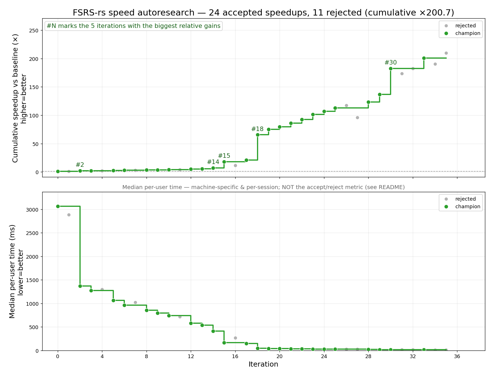
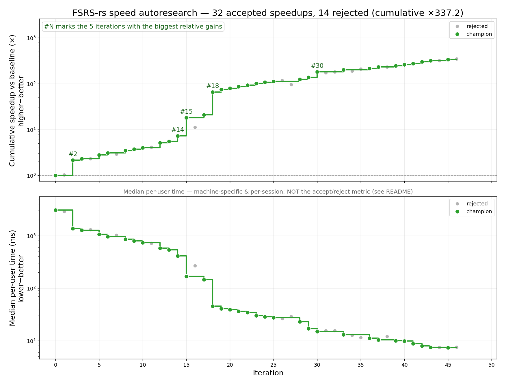

# fsrs-rs-speed-autoresearch

An **autoresearch loop** that made [FSRS-rs](https://github.com/open-spaced-repetition/fsrs-rs) parameter optimization **over 400× faster** — so Anki users spend less time staring at the optimizer's progress bar and more time doing reviews — **while keeping its accuracy within a fixed band**. An AI agent (Claude) proposes a change, measures it under a strict protocol, and keeps it only if it clears both the speed and the correctness bars. Its portable core is already upstream in FSRS-rs ([PR #411](https://github.com/open-spaced-repetition/fsrs-rs/pull/411), [#419](https://github.com/open-spaced-repetition/fsrs-rs/pull/419)). Inspired by AlphaEvolve and [Andrej Karpathy's "autoresearch"](https://github.com/karpathy/autoresearch); see also [my other autoresearch repo](https://github.com/Expertium/fsrs-autoresearch).

[](result/history_plot.png)

Logarithmic Y axes:
[](result/history_plot_log.png)

*Each point is an accepted change, measured against the then-current champion. The top panel is the compounding median speedup vs the original baseline; see [Tracking progress](#tracking-progress).*

> **Working on this repo (human or AI)? Read [`CLAUDE.md`](CLAUDE.md) first.** It is the authoritative spec: goal, measurement protocol, constraints, acceptance bars, code map and profiling findings. This README is the human-facing summary.
>
> **Technical details** — the paired timing protocol, the accuracy band, why the progress plot is slightly optimistic (winner's curse), round-1 breakdowns and portability — are in [`DETAILS.md`](DETAILS.md).

## The idea

The target is the Rust `compute_parameters()` in [`fsrs-rs/`](fsrs-rs) (exposed to Python via [`fsrs_rs_python/`](fsrs_rs_python)) — the routine Anki runs when a user optimizes FSRS parameters. `compute_parameters.py` times it per user and scores it with the frozen Rust `evaluate()` (train set == test set); `benchmark.py` is the 5-fold reference harness for honest accuracy.

A candidate is **accepted only if** all of these hold:

- **Speed:** the median user is **≥5% faster** (median over 50 users of the per-user time ratio), and the gain out-runs any added code complexity (`speed ≥ complexity_ratio^2.5`, see `complexity.py`).
- **One user alone:** the gain also holds for a single user optimized alone (no wins that only appear with many users in parallel).
- **Accuracy:** math-preserving changes must reproduce the champion bit-for-bit; reassociation/precision changes must keep the 50-user mean LogLoss in **[0.3078, 0.3113]** — the original 0.3098, −0.0020/+0.0015 (the lower end was widened by 0.0005 on 2026-09-29, when the champion sat just above the old edge, so a small accuracy *gain* no longer fails the check).
- **Portable:** no CPU- or OS-specific tricks (the SIMD is the SSE2/NEON baseline), at most 2 threads per user, same epochs, seed and hyperparameters.

## Measuring

**Official timing is paired A/B** (`profiling/measure_paired.py champion.pyd candidate.pyd`): the champion and the candidate run the **same user at the same time** on neighbouring CPU blocks, so background load hits both equally and cancels in the ratio (run-to-run spread ~0.5%, vs ~5% when the two binaries ran one after the other). Each user runs 3 times per binary (min of 3); the binaries swap cores and start order between reps. It uses 4 threads by default (`FSRS_PAIRED_SLOTS` raises it). `profiling/devbench/bench_min.py` is the one-user-alone check.

Setup: put [anki-revlogs-10k](https://huggingface.co/datasets/open-spaced-repetition/anki-revlogs-10k) next to this repo (`../anki-revlogs-10k`), run `uv sync` (builds the Rust extension), then `python profiling/devbench/cache_raw.py` once to cache the per-user arrays. The original speed harness still works:

```bash
uv run compute_parameters.py --algo FSRS-rs --short --secs --recency --processes 10 --max-user-id 50
```

For low-noise timing on Windows the campaign pins the CPU clock and keeps workers off logical CPUs 0–3; see [`DETAILS.md`](DETAILS.md#low-noise-setup-windows).

## Tracking progress

`uv run plot_history.py` renders `result/history.jsonl` to `result/history_plot.png` (linear) and `result/history_plot_log.png` (log y). The top panel is the **product of the accepted iterations' median speed ratios**; the bottom panel is the median per-user time, which is machine- and session-specific and only informational.

The product leans slightly high (a noisy ratio is kept only when it clears 1.05), so the campaign re-checks it with direct **anchor** measurements: in round 2 the product from iter 27 to 58 is ×3.70, while a direct paired run of the iter-27 champion against the final one gives **×3.38** (50 users). See [`DETAILS.md`](DETAILS.md#why-the-cumulative-number-is-slightly-optimistic-winners-curse).

## Results

**Round 1 (iters 0–27): ×98.2 on 1000 users.** The big steps were a hand-written analytic gradient instead of autodiff (×2.17), SIMD across 8 cards (`f32x8`, ×2.50), and an O(N) expanding window instead of O(N²) per-prefix re-runs (×3.12), plus a hand-rolled Adam and build-once batching. One precision trade was later reverted, and porting the finished FSRS-7 model without the per-epoch validation pass added ×1.37 (details in [`DETAILS.md`](DETAILS.md#round-1-in-detail)).

**Round 2 (iters 28–58): a further ×3.38 (50-user anchor), ×3.39 on 1000 users.** Main wins: a second thread that shares each batch's card groups (bit-for-bit, via per-group sums added in a fixed order), SSE2-friendly kernels (the loop is dispatch-bound, so removing moves and spills paid most), a cheaper sigmoid form, skipping lapse-only terms when no card lapsed, caching forward values the backward needs, a lighter batch plan (open-addressing card index, per-card chains), and lazy batch layout plus item frees on the second thread. Mean LogLoss is 0.30826 (50 users), inside the band.

**1000-user validation** (round-2 start vs final champion, paired): median speedup **×3.39** (mean ×3.39; 90% of users between ×3.16 and ×3.73), median time 23.9 → 7.1 ms per user, mean LogLoss 0.317462 → 0.317451. Composed with round 1 (×98.2) and the finished-model port (×1.37), the optimizer is **about ×455 faster** than the original on 1000 users (a composition across two model versions, not one measured chain). Per-user records: `result/round2-1000u-paired-iter58.json`.

**Portability.** All numbers are x86 (Ryzen 9 5950X). The algorithmic core transfers everywhere; the explicit SIMD did not speed up Apple Silicon when the fsrs-rs maintainers tried it (its wide cores already extract that parallelism from scalar code), so ARM users should expect a smaller factor. An AVX2 build (`-C target-cpu=native`) roughly doubles the SIMD part on x86 but is not portable, so it does not count.

## Repo tour

`compute_parameters.py` (speed harness) · `benchmark.py` (reference) · `fsrs-rs/src/` (the Rust crate: `training.rs` plan/threads/Adam, `kernel_simd.rs` the SIMD forward+backward, `inference.rs` the frozen scorer) · `fsrs_rs_python/` (PyO3 binding) · `profiling/` (paired timing, probes) · `result/` (per-user records, history, plots). Full map: *Code layout* in [`CLAUDE.md`](CLAUDE.md).
